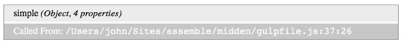
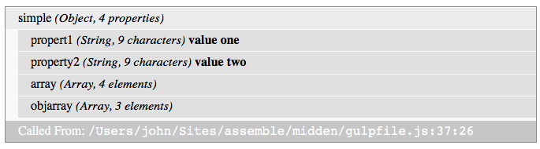
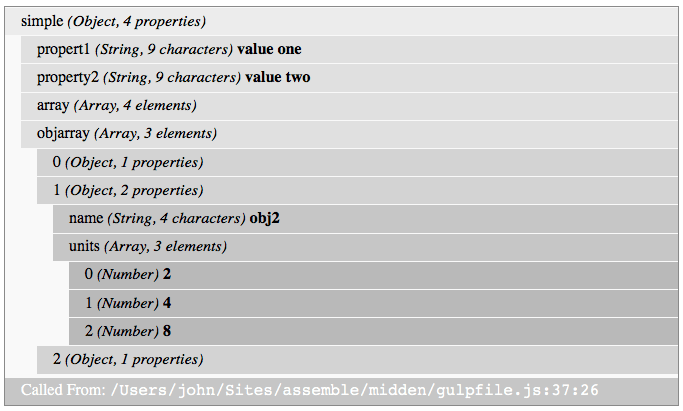

# midden
Pretty data dumps to the browser for your node apps (similar to PHP's Krumo)

**NOTE:** midden is currently in beta, but should soon be complete. (June 27, 2016)

# About
> **Midden**
> 
> A midden (also kitchen midden or shell heap; from early Scandinavian; Danish: mødding, Swedish regional: mödding) is an old dump for domestic waste which may consist of animal bone, human excrement, botanical material, vermin, shells, sherds, lithics (especially debitage), and other artifacts and ecofacts associated with past human occupation.
> 
> From: https://en.wikipedia.org/wiki/Midden

## The Problem
In JavaScript you can usually dump variables and objects you want to inspect into the browser console, the command line or inspect them with a debugger. But in some use cases (static site generation, for example) you might want to dump data into the HTML output of your app. The usual method is to convert your object to JSON and write it out between a pair of ```<pre>``` tags.

```html
<pre>
{
	"foo": "bar",
	"baz": 42
}
</pre>
```

This works out fine for simpler objects, but becomes way to messy for larger, more complicated objects.

## What Midden Does
Midden gives you a more organized way to view and explore your data. Inspired by the PHP library [Krumo](http://krumo.sourceforge.net), Midden provides a way to output your objects in a expandable tree format.

Here's what Midden output looks like on page load...


Clicking the text *simple (Object, 4 properties)* expands the display and reveals it's four properties.



We can select more properties for expansion and dig down into our object.



The footer of our Midden display tells us which line midden was called from so that we can remove the call to midden when we're done.

# Install
Npm installation coming soon.

Also coming soon, a Handlebar Helper.

# Use

## Creating Midden Markup
Call ```midden(variable, [label='...'])``` with the variable you want to examine and an optional label. 

```js
var midden = require('midden');

var yourObject = {
	'foo': 'bar',
	'list': [2,4,8,16]
};

var middenHtml = midden(yourObject, 'object name');

```
A string of html will be returned that you then can insert into your app's output.

## Including client-side code

Viewing and interacting with midden output in the browser requires adding CSS and JS files to generated HTML files for presentation and interactivity. You'll find both in the ```dist/``` directory.

### Style Sheets
Choose one of files listed in the ```dist/styles``` directory.

* midden.css
* midden.min.css (Uglified)
* midden.scss (SASS, with over-rideable defaults)

If you're using gulp or another build system to prepare your CSS, just include the full path (including extension) to one of these stylesheets in your list of sources.

###Javascript
```dist/js/midden-client.js```


# Customizing Styles
The ```dist/styles/midden.scss``` file uses over-writable default values for colors, etc. See the file for a list of values. 

# Release History
### v0.1.0
Beta release

# Contributing
Feel free to submit [issues](https://github.com/criticalmash/midden/issues) or pull requests. Questions on use can also be submitted to the issue queue.

The midden function also has a suite of unit tests. ```mocha test/*-spec.js```

There is also a gulp file for generating client-side assets and integration testing. ``gulp default`` will spin up a server on port 8000.

# License
© 2016 John O'Donnell (Critical Mash Inc.) Released under the [MIT license](LICENSE).